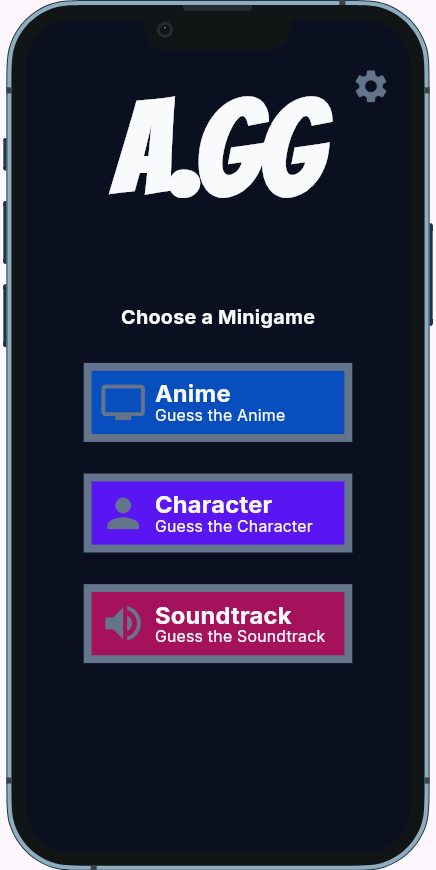
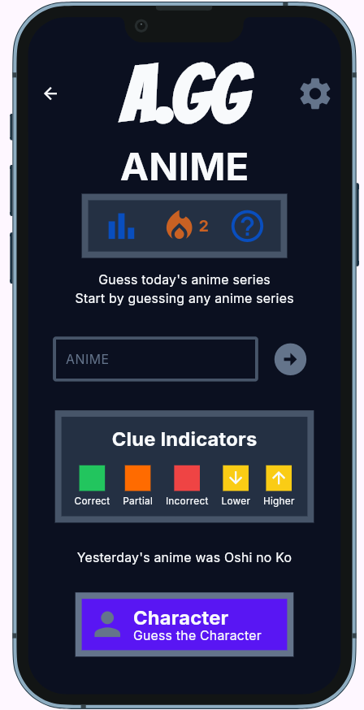
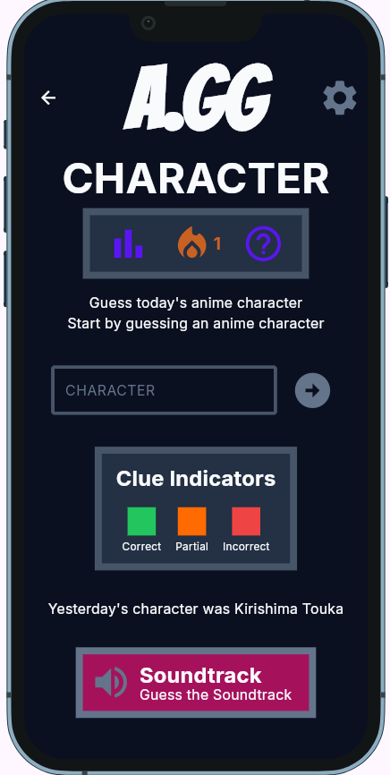
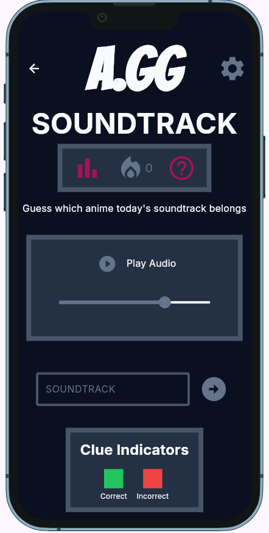

# A.GG

**Live demo:** https://tyroneaquino.github.io/agg/ <br>
**Demo video:** `docs/demo.mp4` <br>
**Course:** Applications Development and Emerging Technologies (6ADET), Holy Angel University <br>
**Author:** Aquino, Tyrone Andrei C. <br>

---

## Screenshots

```markdown
| Home | Anime | Character | Soundtrack |
| --- | --- | --- | --- |
|  |  |  |  |
```

## What it does

Three to five bullets. What can a user actually do?

- A user can play three minigames with two different mode.
- A user can track their game progress.
- A user can switch device to transfer progress.

## Built with

| | |
| --- | --- |
| Framework | Flutter (Dart) |
| State | `setState` |
| Storage | Supabase |
| Other packages | - device_preview (mobile phone simulation) <br> - google_fonts (application font families) <br> - supabase_flutter (for data storage and backend) <br> - just_audio (audio package for Soundtrack minigame) |

## Running it yourself

**Requirements:***
- Dart SDK version 3.12.2 or later
- Flutter version 3.44.9 or later
- Supabase Database

**Create Your Own Supabase Project:**
1. Create a new project in Supabase.
2. Run the the SQL queries using [schema.sql](docs/assets/schema.sql) in your Supabase SQL Editor. 
3. Populate your database using the provided CSV files:
  - [anime.csv](docs/assets/anime.csv)
  - [character.csv](docs/assets/character.csv)
  - [soundtrack table](docs/assets/soundtrack.csv)
  - [answer table](docs/assets/answers.csv)
  - *You can use these csv to populate your own database or create your own.*
  - *On soundtrack I suggest to use Supabase to store your raw mp3 files and use the link as values. Supabase Project -> Storage -> + New Bucket -> Store the mp3 files here*
  - *Beware of copyright concerns, this A.GG only uses one instrumental cover instead of the original soundtrack*
4. Copy the entire [index.ts](supabase/functions/device-transfer/index.ts) at Supabase Project -> Edge Function -> Deplay a new function -> via Editor -> name the function as 'device-transfer' -> Deploy function.
5. Get your own Supabase URL and Supabase Publishable Key: Supabase Project -> Connect -> Get Supabase Url and Publishable Key

**Running AGG:**
1. Clone the repository and install its dependencies
2. Run the app in Chrome on port 5000.

```bash
git clone https://github.com/TyroneAquino/agg.git
cd agg 
flutter pub get
flutter run flutter run -d chrome --web-port 5000 --dart-define=SUPABASE_URL=your_supabase_url --dart-define=SUPABASE_PUBLISHABLE_KEY=your_supabase_publishable_key 
```
- *Running the app on port 5000 allows you to save progress, run -d chrome usually generate random instance of A.GG*
- *Replace your_supabase_url and your_supabase_publishable_key with your actual keys.*

### Environment variables

A.GG receives its Supabase configuration through Dart compile-time environment declarations (--dart-define). It does not require a .env file.
For security, never expose your Supabase secret key, legacy service_role key, or database password. The publishable key is intended for client-side use, but your database must be protected by appropriate RLS policies.

## Privacy and secrets

A.GG collects no personal information, players are signed in anonimously with a random ID, and the only things stored are their game stats nad today's guesses, which goes to my Supabase project and are visibly only to me and the project owner. The Supabase project URL and publishable key passed to the app at build time; the publishable key is public by design, so the data is protected by SUpabase Row Level Security, and the service-role key never leaves Supabase Edge Function. All sample data, screenshots, and the demo video contains no personal information.

See [security-and-privacy](docs/06-security-and-privacy.md).

## Project documentation

| Document | |
| --- | --- |
| [Proposal](docs/01-proposal.md) | the problem, the users, the scope |
| [Mockup and wireframes](docs/02-mockup.md) | what it looks like, and the screen flow |
| [Design system](docs/03-design-system.md) | colors, type, spacing, components |
| [Weekly reports](docs/04-weekly-reports.md) | what happened each week |
| [Demo video](docs/05-demo-video.md) | the recording and what it shows |
| [Security and privacy](docs/06-security-and-privacy.md) | the checklist, filled in |

## Status and what is next

### Status
- All minigames are working as intended.
- Daily Mode progress in all minigames saves and restore progress upon refresh, while Practice Mode will lose progress upon refresh.
- A completed Daily Mode session whether win or lose will not load a completion dialog upon refresh but the guesses will still be shown.
- Only Daily Mode calculates stats, Practice Mode is purely for enjoyment.
- Daily mode completed or not, win or lose records stats.
- Running A.GG on different ports may result in separate browser sessions or user identities, depending on the authentication and persistence implementation. Use the same port and browser session when testing progress persistence.
- A.GG has no accounts to login or register, progress is saved entirely by the device.

### What is next
- Daily Mode upon refresh will show a completion dialog whether its a win or lose.

## Credits

- Packages: see `pubspec.yaml`
- See [ATTRIBUTIOn.md](docs/ATTRIBUTION.md) to see assets' author and license.
- People who helped:
  - Prof. Stolk Tjaoken: suggested to use GitHub Action secrets to sore Supabase URL and Publishable Key and provided the project template.

## AI use

For AI use, see [AI-USAGE.md](docs/AI-USAGE.md).

## Licence

MIT, see [LICENSE](LICENSE).
