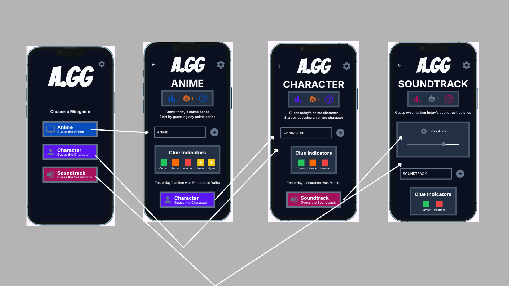
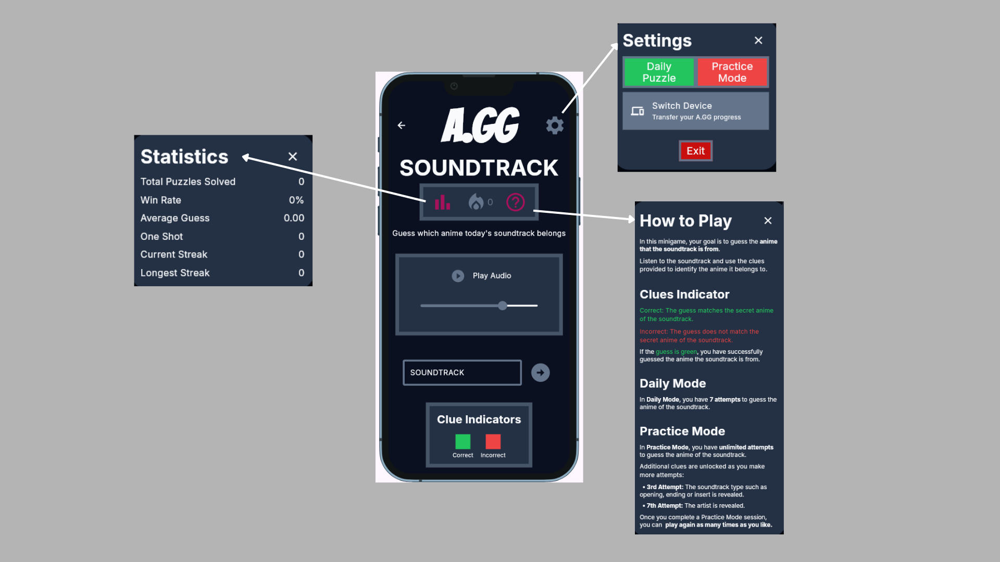

# Mockup and wireframes

The visual plan for this app. Your wireframes answered what goes where; the
mockup shows what it looks like.

## Mockup

### Main Screen

### Anime Minigame

### Character Minigame

### Soundtrack Minigame

## Wireframes

### Screen Wireframe

### Minigame Wireframe

## Screens

- **Main Screen:** Choose three minigames.
- **Anime Screen:** Play the Anime minigame by guessing the secret anime.
- **Character Screen:** Play the Character minigame by guessing the secret character.
- **Soundtrack Screen** Play the Soundtrack minigame by guessing the anime where the soundtrack is from.
- **All Minigame Screens:** Has a stat icon to show statistics, how to play icon to show basic game rules and has a textbox that inputs answers.
- **All Screens:** Has a setting icon that can switch between two game modes, device switching and application exit button.
