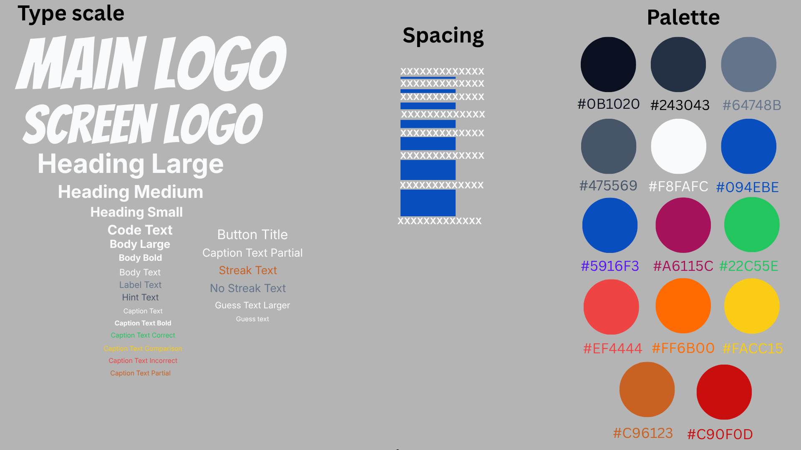

# Design system

Paste in the design system you submitted, and replace it with the final version
when the project is done. It is also the reference you open every time you build
a new screen, so keeping it current helps you more than it helps anyone reading.

**This document needs a visual, not just this text.** Export a PDF or an image
that *shows* your palette, type scale, spacing and components, put it in
`assets/`, and link it here:

## Palette

| Role | Hex | Used For |
| --- | --- | --- |
| background | #0B1020 | main background |
| border | #243043  | border and icons |
| subBorder | #64748B | border for textbox and interactives|
| subBackground | #475569 | background for container |
| body | #F8FAFC | text color |
| anime | #094EBE | color for anime minigame |
| character | #5916F3 | color for character minigame |
| soundtrack | #A6115C | color for soundtrack minigame |
| correct | #22C55E | correct indicator |
| partial| #EF4444  | partial indicator |
| incorrect | FF6B00  | incorrect indicator |
| comparison | #FACC15 | higher or lower indicator |
| flame | #C96123  | streak |
| exit | #C90F0D | exit button |

## Type scale

| Your Style | Flutter slot | Size | Weight | Used for |
|---|---|---:|---|---|
| Main Logo  | `mainlogo` | 128 | Bold | Main Logo |
| Screen Logo  | `screenLogo` | 96 | Bold | Minigame Screen Logo |
| Heading Large  | `headingLarge` | 48 | Bold | Minigame Titles |
| Heading Medium | `headingMedium` | 32 | Bold | Dialog Headings |
| Heading Small | `headingSmall` | 24 | Bold | Headings for buttons |
| Code Text | `codeText` | 24 | Bold | Genereated code for device switching |
| Body Large | `bodyLarge` | 20 | Bold | Large body text |
| Body Text | `bodyText` | 16 | Normal | Body text |
| Label Text | `labelText` | 16 | Normal | Minigame Button |
| Hint Text | `hintText` | 16 | Normal | Autocomplete hint |
| Body Bold | `bodyBold` | 16 | Bold | Body text |
| Caption Text | `captionText` | 12 | Normal | Caption Text  |
| Caption Text Bold | `captionTextBold` | 12 | Bold | Caption Text Bold |
| Caption Text Correct | `captionTextCorrect` | 12 | Normal | How to play  |
| Caption Text Incorrect | `captionTextIncorrect` | 12 | Normal | How to play |
| Caption Text Partial | `captionTextPartial` | 12 | Normal | How to play |
| caption Text Comparison | `captionTextComparison` | 12 | Normal | How to play |
| Button Title | `buttonTitle` | 24 | Bold | button title |
| Button Caption | `buttonCaption` | 16 | Normal | button caption |
| GeneralButton | `generalButton` | 20 | Normal | general button |
| StreakText | `streakText` | 20 | Bold | Streak number |
| No Streak Text | `noStreakText` | 20 | Normal | Streak 0 |
| Guess Text | `guessText` | 12 | Normal | Guess text for anime and character |
| Guess Text Larger | `guessTextLarger` | 16 | Normal | guess text for soundtrack |

## Spacing

| Description | Size | Used in |
| Small spacing | 4 | Settings button placement, clues indicators list |
| Base spacing  | 8 | Base Application padding |
| Medium spacing | 16 | Lists |
| Big spacing | 20 | Dialogs and boxes |
| Large spacing | 32 | Between large widgets |
| XL spacing | 48 | Separates the minigame and the next button |
| XXL spacing | 64 | In main |

## Components

| Widget | File | Parameters | Screens |
| --- | --- | --- | --- |
| ClueBox | clue_box.dart | MinigameType minigame   String firstClue   final String secondClue   final int attempt   Soundtrack? soundtrack| All minigame screens |
| ClueIndicator | clue_indicator.dart | MinigameType minigame | All minigame screens |
| DialogBox | dialog_box.dart | DialogType title   PlayerStats? stats   MinigameType? minigame   GameState? gameState   Soundtrack? soundtrack   Future<void> Function()? playAgain| All minigame screens |
| GeneralButton | general_button.dart | String title   Color color   VoidCallback onPressed | All screens |
| GuessColumnSoundtrack | guess_column.dart | Soundtrack guess   Soundtrack answer | Sountrack minigame screen |
| GuessRowAnime | guess_row_anime.dart | Anime guess   Anime answer | Anime minigame screen |
| GuessRowCharacter | guess_row_character.dart | Character guess    Character answer | Character minigame screen |
| MinigameButton | minigame_button.dart | MinigameType minigame   GameState gameState | All screens |
| Textbox | textbox.dart | MinigameType minigame   List<String> names   ValueChanged<String> onSubmit | All minigame screens |
| TopInterface | top_interface.dart | MinigameType minigame   PlayerStats stats | All minigame screens |

## Changes since the last version

| Element | Before | Now | Why it changed |
| --- | --- | --- | --- |
| Palette | 15 handpicked colors | 7 handpicked colors, 3 color changes, 3 new colors, removed 5, now in a total of 13 colors | The 3 changed colors failed the contrast test, so I changed it, added 3 new colors for the app and kept the remaining important for the app |
| Spacing | Not specified | 7 spacing | To maintain a uniform setup |
| Component | Box components only | 10 components | Instead of creating a reusable card I created 10 reusable component that could be used by the app |